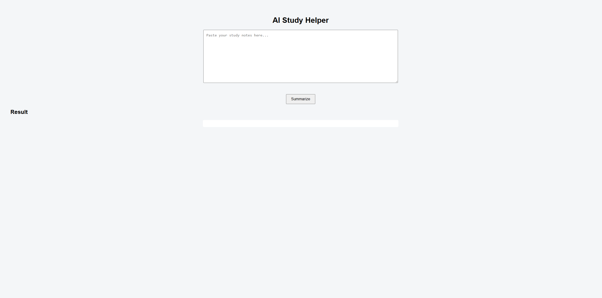
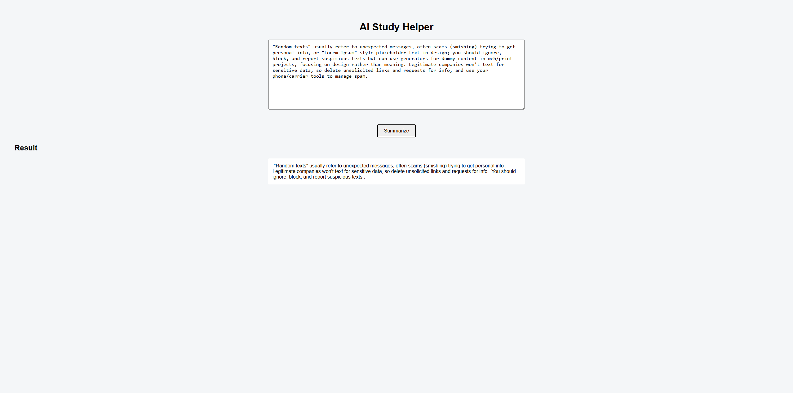

📘 AI Study Helper

📊 Overview
This project is a small AI-powered study helper that takes class notes or study text and generates a short summary. The goal of the project is not to build a complex AI system, but to practice connecting a JavaScript frontend with a Python backend and an open-source NLP model.
The app is meant to be lightweight and easy to understand, similar to tools students already use when reviewing notes before exams.

📸 Screenshots

🧠 What It Does

- Accepts pasted study notes from the user
- Sends the text to a Python backend
- Uses an open-source summarization model to generate a concise summary
- Displays the result in the browser
- This project focuses more on structure and communication between components than on perfect AI output.

⚙️ Tools Used

- Python 3.14
- Flask (backend API)
- HuggingFace Transformers (open-source NLP)
- PyTorch
- HTML / CSS
- Vanilla JavaScript (Fetch API)

📈 Project Notes

- The summarization model runs locally (no paid APIs)
- First run downloads the model and may take a bit longer
- Designed as a simple, readable project rather than a production app

🎯 Purpose
The purpose of this project is to demonstrate:

- Frontend ↔ backend communication
- Basic REST API design
- Practical use of machine learning libraries

Clean project organization suitable for a GitHub portfolio

📎 Author
Created by Aidan Sanchez
AI Study Helper Project (2025)